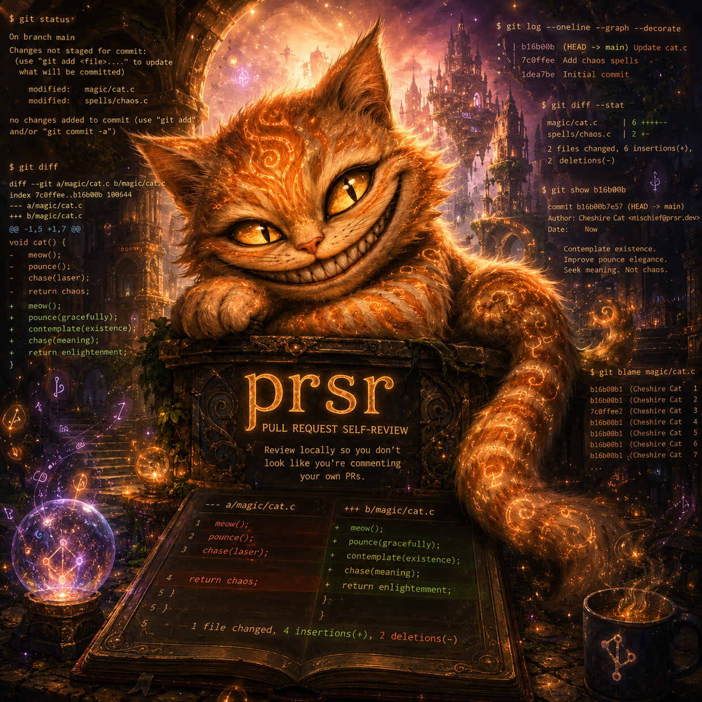

# prsr

<p align="center">
  
</p>

<p align="center">
  <strong>prsr</strong> (pronounced “pur-sir”) — pull request self-review.<br>
  GitHub-style diffs with line numbers, as a local text file.
</p>

<p align="center">
  <a href="https://github.com/bluesentinelsec/prsr/actions/workflows/ci.yml"></a>
  <a href="https://bluesentinelsec.github.io/prsr/"></a>
  <a href="LICENSE"></a>
</p>

A workflow I like is to have an agentic coding assistant implement a feature and open a pull request on my behalf. I then review the pull request on GitHub, leaving in-line comments for changes. The problem with this workflow is it may appear to outsiders that you are commenting your own pull requests, even though AI implemented the code.

Enter `prsr`. `prsr` renders the same diff you see on GitHub, but locally as a text file on your machine. You are free to leave comments in private without looking like you talk to yourself. 🤪

**Docs:** [https://bluesentinelsec.github.io/prsr/](https://bluesentinelsec.github.io/prsr/)

## Install

`prsr` requires Python 3.8+ and [`gh`](https://cli.github.com/) on `PATH` (`gh auth login`). `prsr` does not store tokens; it calls `gh` for GitHub-backed commands. `--diff` does not need `gh`.

Install with pip:

```bash
pip install git+https://github.com/bluesentinelsec/prsr.git@latest
```

## Quick start

Generate a diff from a specified PR:

```bash
prsr --pr 1234 -o review.diff
vim review.diff
```

Other sources:

```bash
prsr --commit abc123
prsr --base main --head feature-branch
prsr --repo owner/name --pr 1234
git diff main...HEAD | prsr --diff -
```


## What you comment on

```diff
# prsr numbered diff | OLD  NEW  CODE | source=pr:1234
diff --git a/hello.py b/hello.py
--- a/hello.py
+++ b/hello.py
@@ -1,4 +1,5 @@
    1    1 def greet():
    2    2     name = "world"
-   3          print("hello")
+        3     print("hello,")
# nit: drop the comma
+        4     print(name)
    4    5     return name
```

OLD is GitHub’s left side, NEW is the right. Additions have only NEW; deletions have only OLD. Put notes on their own lines. Leave numbered source lines alone.

## Library

`prsr` can be invoked as a Python library:

```python
from prsr import render_pr, render_commit, render_compare, render_diff

text = render_pr("1234")
```

See the [library docs](https://bluesentinelsec.github.io/prsr/library/).

## Contributing

```bash
# local dev install
python -m pip install -e ".[dev,docs]"
python -m pytest
```

See [CONTRIBUTING.md](CONTRIBUTING.md).

## License

[GNU General Public License v2](LICENSE).
